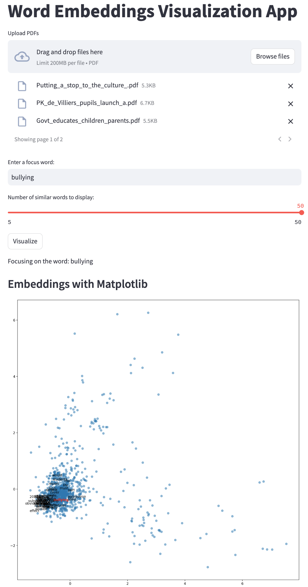

# Word Embeddings Visualization Tool

Visualize word embeddings from PDF documents. Dive deep into relationships, similarities, and clusterings of words from your textual content.

There are two ways to make use of the designed word embeddings visualization tool:

-**Cloud Access**: You can directly use the app by accessing this [link](https://embeddings.streamlit.app/). This link takes you to the app hosted on Streamlit, a platform for turning Python scripts into interactive web apps. Please note that the cloud version has some storage limitations.

-**Local Setup**: For a more personalized experience without limitations, you can run the app locally. To do this, download the GitHub repository and set it up on your PC. This repository contains all the necessary code, including the app design, word embeddings algorithms, and the visualization component.

Below is a screenshot showcasing an example from the app and one aspect of the visualised results:


 


## 🌟 Features

- **Upload PDFs**: Seamlessly upload one or multiple PDF documents.
- **Dynamic Word Embedding**: Generates embeddings using the powerful Word2Vec algorithm.
- **Visualizations**: Dive into various visualizations:
  - 📊 **Plotly Scatter Plot**: Highlighting the focus word and its most similar words.
  - 📉 **Matplotlib Scatter Plot**: Distinct color and style for the focus word.
  - ☁️ **Word Cloud**: Visual representation of word frequency.
  - 📊 **Histogram of Word Frequencies**: Top 20 words spotlight.
  - 🌡️ **Similarity Heatmap**: Cosine similarities between the focus word and the document words.
  - 🌲 **Clustering of Words**: Hierarchical clustering for word groupings.
- **Customizable**: Choose your focus word and the number of similar words for tailored insights.

## 🚀 Getting Started

### Prerequisites

For local setup, ensure you have Python installed along with the necessary libraries. The repository was built using Python 3.11.4. To avoid conflicts with other Python projects and ensure consistent behavior, it's recommended to set up and use a Python virtual environment.

### Installation & Running

1. Clone the repository:

```bash
   git clone https://github.com/themisdx/embeddings_app.git
```

2. Set up a Python Virtual Environment (Recommended):

```bash
  python -m venv venv
```

And activate for Windows:

```bash
  venv\Scripts\activate
```

For macOS and Linux:

```bash
source venv/bin/activate
```

3. Install the Necessary Libraries:
  
```bash
  pip install -r requirements.txt
```

4. Run the app:

```bash
streamlit run embeddings_app.py
```

## 🙌 Contribute
Feel the need for an extra feature or want to fix a bug? Open an issue or send us a pull request. Contributions are more than welcome!

## 📜 License
This project is under the MIT License.
